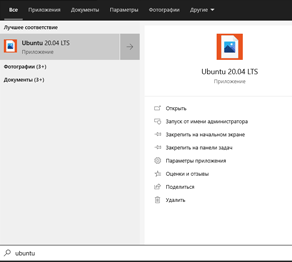
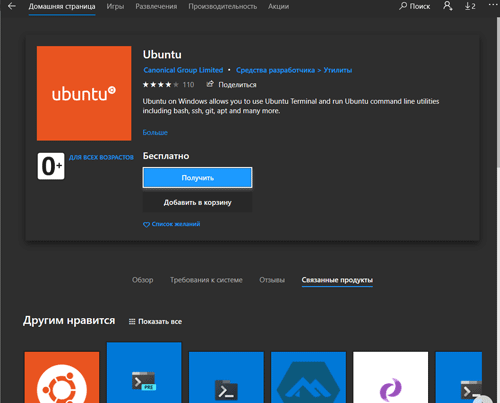

# <a name="wsl-commands-and-launch-configurations"></a>Команды WSL и конфигурации запуска

## <a name="ways-to-run-wsl"></a>Способы запуска WSL

Существует несколько способов запустить дистрибутив Linux с WSL после [установки](install-win10.md).

1. Откройте дистрибутив Linux, перейдя в меню Пуск Windows и введя имя установленных дистрибутивов. Например: Ubuntu.
2. В командной строке Windows или PowerShell введите имя установленного дистрибутива. Пример: `ubuntu`
3. В командной строке Windows или PowerShell чтобы открыть дистрибутив Linux по умолчанию в текущей командной строке, введите: `wsl.exe` .
4. В командной строке Windows или PowerShell чтобы открыть дистрибутив Linux по умолчанию в текущей командной строке, введите: `wsl [command]` .

Применяемый метод зависит от того, что вы делаете. Если вы открыли командную строку WSL в командной строке Windows или окне PowerShell и хотите выйти, введите команду: `exit` .

## <a name="launch-wsl-by-distribution"></a>Запуск WSL

### При помощи дистрибутива

При запуске дистрибутива с помощью специального приложения он запускается в собственном консольном окне.



Это то же самое, что нажать кнопку "Запустить" в Microsoft Store.



Можно также запустить дистрибутив из командной строки, выполнив команду `[distribution].exe`.

Недостаток запуска дистрибутива из командной строки заключается в том, что рабочий каталог с текущего поменяется на корневой каталог дистрибутива.

**Пример: (с помощью PowerShell)**

```console
PS C:\Users\sarah> pwd

Path
----
C:\Users\sarah

PS C:\Users\sarah> ubuntu

scooley@scooley-elmer:~$ pwd
/home/scooley
scooley@scooley-elmer:~$ exit
logout

PS C:\Users\sarah>
```

### <a name="wsl-and-wsl-command"></a>Использование wsl и wsl [команда]

Лучший способ запуска WSL из командной строки — использовать `wsl.exe`.

**Пример: (с помощью PowerShell)**

```console
PS C:\Users\sarah> pwd

Path
----
C:\Users\sarah

PS C:\Users\sarah> wsl

scooley@scooley-elmer:/mnt/c/Users/sarah$ pwd
/mnt/c/Users/sarah
```

Выполнение команд `wsl` помимо сохранения текущего каталог позволяет выполнить одиночную команду в дистрибутиве с последующим возвращением в командную строку Windows.

**Пример: (с помощью PowerShell)**

```console
PS C:\Users\sarah> Get-Date

Sunday, March 11, 2018 7:54:05 PM

PS C:\Users\sarah> wsl
scooley@scooley-elmer:/mnt/c/Users/sarah$ date
Sun Mar 11 19:55:47 DST 2018
scooley@scooley-elmer:/mnt/c/Users/sarah$ exit
logout

PS C:\Users\sarah> wsl date
Sun Mar 11 19:56:57 DST 2018
```

**Пример: (с помощью PowerShell)**

```console
PS C:\Users\sarah> Get-VM

Name            State CPUUsage(%) MemoryAssigned(M) Uptime   Status
----            ----- ----------- ----------------- ------   ------
Server17093     Off   0           0                 00:00:00 Opera...
Ubuntu          Off   0           0                 00:00:00 Opera...
Ubuntu (bionic) Off   0           0                 00:00:00 Opera...
Windows         Off   0           0                 00:00:00 Opera...


PS C:\Users\sarah> Get-VM | wsl grep "Ubuntu"
Ubuntu          Off   0           0                 00:00:00 Opera...
Ubuntu (bionic) Off   0           0                 00:00:00 Opera...
PS C:\Users\sarah>
```

## <a name="managing-multiple-linux-distributions"></a>Управление несколькими дистрибутивами Linux

В Windows 10 версии 1903 [и более поздних](ms-settings:windowsupdate)можно использовать `wsl.exe` для управления дистрибутивами в подсистеме Windows для Linux (WSL), включая список доступных дистрибутивов, настройку распределения по умолчанию и удаление дистрибутивов.

Каждый дистрибутив Linux независимо управляет собственными конфигурациями. Чтобы просмотреть команды, относящиеся к определенному дистрибутиву, выполните команду `[distro.exe] /?`.  Например, `ubuntu /?`.

## <a name="list-distributions"></a>Вывод списка дистрибутивов

`wsl -l` , `wsl --list`  
Cписок доступных дистрибутивов Linux, совместимых с WSL.  Если дистрибутив есть в списке, значит он установлен и готов к использованию.

`wsl --list --all`
Список всех дистрибутивов, включая те, которые сейчас не используются.  Они могут находиться в процессе установки, удаления или в неработающем состоянии.  

`wsl --list --running`
Список всех распределений, выполняемых в данный момент.

## <a name="set-a-default-distribution"></a>Настройка дистрибутива по умолчанию

Дистрибутив по умолчанию WSL запускается при выполнении `wsl` в командной строке.

`wsl -s <DistributionName>`, `wsl --setdefault <DistributionName>`

Команды выше используют имя дистрибутива `<DistributionName>` для определения его по умолчанию.

**Пример: (с помощью PowerShell)**  
Команда `wsl -s Ubuntu` в качестве дистрибутива по умолчанию установит Ubuntu.  Теперь при выполнении `wsl npm init` эта команда будет выполняться в Ubuntu.  Если выполнить `wsl`, откроется сеанс Ubuntu.

## <a name="unregister-and-reinstall-a-distribution"></a>Отмена регистрации дистрибутива и повторная установка дистрибутива

Хотя дистрибутивы Linux можно устанавливать из приложения Microsoft Store, удалить их в приложении невозможно. WSL Config позволяет проделать данные манипуляции с дистрибутивом.

Отмена регистрации также позволяет переустановить дистрибутивы.

> **Внимание!** После отмены регистрации все данные, параметры и программное обеспечение, связанные с этим распределением, будут безвозвратно утеряны.  При переустановке из MS Store будет установлена чистая копия дистрибутива.

`wsl --unregister <DistributionName>`  
Отменяет регистрацию дистрибутива в WSL, таким образом дистрибутив можно переустановить или сбросить.

Например:
`wsl --unregister Ubuntu` приведет к удалению Ubuntu из дистрибутивов, доступных в WSL.  При выполнении команды `wsl --list` этот дистрибутив не будет присутствовать в списке.

Чтобы переустановить его, найдите этот дистрибутив в Microsoft Store и нажмите кнопку "Запустить".

## <a name="run-as-a-specific-user"></a>Выполнение от имени определенного пользователя

`wsl -u <Username>`, `wsl --user <Username>`

Открывает терминал дистрибутива WSL от имени указанного пользователя. Важно: данный пользователь должен быть создан внутри дистрибутива.

## <a name="change-the-default-user-for-a-distribution"></a>Изменение пользователя по умолчанию в дистрибутиве

`<DistributionName> config --default-user <Username>`

Изменение пользователя по умолчанию, который используется для входа в дистрибутив. Пользователь должен уже существовать в распределении, чтобы стать пользователем по умолчанию. 

Например,
`ubuntu config --default-user johndoe` изменит пользователя по умолчанию для дистрибутива Ubuntu на пользователя "JohnDoe".

> [!NOTE]
> Если у вас возникли проблемы с определением имени дистрибутива, см. [вывод списка дистрибутивов](#list-distributions) для команды, чтобы получить список официальных названий установленных дистрибутивов. 

## <a name="run-a-specific-distribution"></a>Запуск дистрибутива по выбору

`wsl -d <DistributionName>`, `wsl --distribution <DistributionName>`

Запускает дистрибутив WSL с указанным именем, может использоваться для исполнения команд в определенном дистрибутиве без необходимости замены дистрибутива по умолчанию.

## <a name="managing-multiple-linux-distributions-in-earlier-windows-versions"></a>Управление несколькими дистрибутивами Linux в более ранних версиях Windows

В Windows 10 до версии 1903 для управления дистрибутивами Linux, работающими в подсистеме Windows для Linux (WSL), необходимо использовать утилиту командной-строки WSL config ( `wslconfig.exe` ).  Она позволяет получить список доступных дистрибутивов, настроить дистрибутив по умолчанию и удалить дистрибутивы.

Хотя WSL Config удобно использовать для параметров, охватывающих или координирующих несколько дистрибутивов, каждый дистрибутив Linux независимо управляет собственными конфигурациями.  Чтобы просмотреть исполняемых команд внутри определённого дистрибутива, выполните команду `[distro.exe] /?`.  Например, `ubuntu /?`.

Чтобы просмотреть все доступные параметры для wslconfig, выполните команду `wslconfig /?`

```console
wslconfig.exe
Performs administrative operations on Windows Subsystem for Linux

Usage:
    /l, /list [/all] - Lists registered distributions.
        /all - Optionally list all distributions, including distributions that
               are currently being installed or uninstalled.
    /s, /setdefault <DistributionName> - Sets the specified distribution as the default.
    /u, /unregister <DistributionName> - Unregisters a distribution.
```

Чтобы вывести список дистрибутивов, используйте:

`wslconfig /list`  
Выводит список доступных дистрибутивов Linux, совместимых с WSL.  Если дистрибутив есть в списке, он установлен и готов к использованию.

`wslconfig /list /all`  
Выводит список всех дистрибутивов, включая те, которые сейчас не используются.  Они могут находиться в процессе установки, удаления или в неработающем состоянии.  

Чтобы выбрать дистрибутив, по умолчанию исполняемый при выполнении `wsl` в командной строке:

`wslconfig /setdefault <DistributionName>` Установит дистрибутив по умолчанию по имени `<DistributionName>` .

**Пример: (с помощью PowerShell)**  
Команда `wslconfig /setdefault Ubuntu` в качестве дистрибутива по умолчанию установит Ubuntu.  Теперь при выполнении `wsl npm init` эта команда будет выполняться в Ubuntu.  Если выполнить `wsl`, откроется сеанс Ubuntu.

Чтобы отменить регистрацию и переустановить дистрибутив, выполните следующие действия.

`wslconfig /unregister <DistributionName>`  
Отменяет регистрацию дистрибутива в WSL, чтобы его можно было переустановить или очистить.

Например:
`wslconfig /unregister Ubuntu` приведет к удалению Ubuntu из дистрибутивов, доступных в WSL.  При выполнении команды `wslconfig /list` этот дистрибутив не будет присутствовать в списке.

Чтобы переустановить его, найдите этот дистрибутив в Microsoft Store и нажмите кнопку "Запустить".

## <a name="configure-per-distro-launch-settings-with-wslconf"></a>Настройка параметров запуска дистрибутив с помощью wslconf

> **Доступно в Windows Build 17093 и более поздних версиях**

Возможность автоматической настройки определенного функционала в WSL, применимого при каждом запуске дистрибутива с помощью `wsl.conf`.

На данный момент сюда входят параметры автоподключения и конфигурация сети.

Файл `wsl.conf` в каждом дистрибутиве Linux находится в папке `/etc/wsl.conf`. Если этот файл отсутствует, его можно создать самостоятельно. WSL обнаружит наличие файла и прочитает его содержимое. Если этот файл отсутствует или имеет ошибки (неправильно размече внутри), WSL продолжит запуск с параметрами по умолчанию.

Ниже приведен пример файла конфигурации `wsl.conf`, который можно добавить в дистрибутивы.

```console
# Enable extra metadata options by default
[automount]
enabled = true
root = /windir/
options = "metadata,umask=22,fmask=11"
mountFsTab = false

# Enable DNS – even though these are turned on by default, we'll specify here just to be explicit.
[network]
generateHosts = true
generateResolvConf = true
```

### <a name="configuration-options"></a>Параметры конфигурации

В соответствии правилами создания INI-файлом, ключи объявляются внутри раздела. 

WSL поддерживает два раздела: `automount` и `network`.

#### <a name="automount"></a>automount

Раздел: `[automount]`

| ключ        | тип значения                          | по умолчанию      | примечания                                                                                                                                                                                                                                                                                                                          |
|:-----------|:-------------------------------|:-------------|:-------------------------------------------------------------------------------------------------------------------------------------------------------------------------------------------------------------------------------------------------------------------------------------------------------------------------------|
| enabled    | логический                        | true         | Значение `true` обеспечивает автоматическое подключение стационарных дисков (например, `C:/` или `D:/`) DrvFs в `/mnt`.  `false` означает, что диски не будут подключены автоматически, но их можно подключать вручную или через `fstab`.                                                                                                             |
| mountFsTab | логический                        | true         | Если значение `true`, то конфигурация `/etc/fstab` будет применена при запуске WSL. /etc/fstab — это файл, в котором можно объявлять другие файловые системы, например общий ресурс SMB. Таким образом можно автоматически подключать такие файловые системы в WSL при запуске.                                                                                                                |
| root       | строка                         | `/mnt/`      | Задает каталог, в который будут автоматически подключены стационарные диски. Например, если у вас в дистрибутиве WSL есть каталог `/windir/` и вы указали его в качестве корневого, то ваши стационарные диски будут подключены в `/windir/c`                                                                                              |
| options    | список значений, разделенный запятыми | пустая строка | Это значение добавляется в конец строки стандартных параметров подключения DrvFs. **Можно указать только параметры, относящиеся к DrvFs.** Параметры, которые программа для подключения дисков обычно преобразовывает во флаг, не поддерживаются. Если вы хотите явно указать эти параметры, необходимо добавить каждый диск, для которого вы хотите это сделать, в /etc/fstab. |

Изначально WSL задает значения идентификаторов UID и GID как у пользователя по умолчанию (в дистрибутиве Ubuntu пользователь по умолчанию создается с идентификаторами UID = 1000 и GID = 1000). Если пользователь явно указывает параметр GID или UID с помощью этого ключа, соответствующе значение будет переопределено. В противном случае всегда будет добавляться значение по умолчанию.

**Примечание**. Эти параметры применяются в качестве параметров подключения для всех автоматически подключаемых дисков. Чтобы изменить параметры для отдельно взятого диска, используйте конфигурацию в /etc/fstab.

#### <a name="mount-options"></a>Параметры подключения

Задание различных параметров подключения для дисков Windows (DrvFs) позволяет контролировать как определяются разрешения для файлов Windows. Доступны следующие параметры:

| Ключ | Описание | Значение по умолчанию |
|:----|:----|:----|
|uid| Идентификатор пользователя, значение устанавливается для всех файлов в качестве владельца. | ID пользователя по умолчанию для дистрибутива WSL (при первой установке имеет значение по умолчанию — 1000).
|gid| Идентификатор группы, значение устанавливается для всех файлов в качестве владельца. | ID группы по умолчанию для дистрибутива WSL (при первой установке имеет значение по умолчанию — 1000).
|umask | Обратная восьмеричная маска разрешений, определяемая для всех файлов и каталогов. | 000 <br> (Разрешение на чтение запись и исполнение)
|fmask | Обратная восьмеричная маска разрешений, исключаемых для всех файлов. | 000 <br> (Разрешение на чтение запись и исполнение)
|dmask | Обратная восьмеричная маска разрешений, исключаемых для всех каталогов. | 000 <br> (Разрешение на чтение запись и исполнение)

**Примечание**. Маски разрешений подвергаются логической операции ИЛИ перед применением к файлам или каталогам. 

#### <a name="network"></a>сеть

Метка раздела: `[network]`

| ключ | тип значения | по умолчанию | примечания|
|:----|:----|:----|:----|
| generateHosts | логический | `true` | Значение `true` указывает WSL создать `/etc/hosts`. Файл `hosts` содержит статическую карту имен узлов и соответствующих IP-адресов. |
| generateResolvConf | логический | `true` | Значение `true` указывает WSL создать `/etc/resolv.conf`. Файл `resolv.conf` содержит список DNS-серверов, которые способны преобразовывать доменные имена в IP-адреса. | 

#### <a name="interop"></a>операционная совместимость

Метка раздела: `[interop]`

Эти параметры доступны в Insider Build 17713 и на более поздних версиях.

| ключ | тип значения | по умолчанию | примечания |
|:----|:----|:----|:----|
| enabled | логический | `true` | Установка этого ключа определяет, будет ли WSL поддерживать запуск процессов Windows из терминала дистрибутива. |
| appendWindowsPath | логический | `true` | Задание этого ключа определяет, будет ли WSL добавлять элементы пути Windows в переменную среды $PATH. |

#### <a name="user"></a>пользователь

Метка раздела: `[user]`

Эти параметры доступны в Insider Build 18980 и на более поздних версиях.

| ключ | тип значения | по умолчанию | примечания |
|:----|:----|:----|:----|
| default | строка | Исходное имя пользователя, созданное при первом запуске | Задание этого параметра указывает под каким пользователем будет запускаться сеанс Дистрибутива WSL. |

## <a name="configure-global-options-with-wslconfig"></a>Настройка глобальных параметров с помощью .wslconfig

> **Доступна в Windows Build 19041 и более поздних версиях**

Вы можете настроить глобальные параметры WSL, поместив файл `.wslconfig` в корневой каталог папки пользователя: `C:\Users\<yourUserName>\.wslconfig` . Многие из этих файлов связаны с WSL 2, поэтому, возможно вам потребуется отстановить все дистрибутивы через `wsl --shutdown` и после заново запустить дистрибутив WSL, чтобы эти изменения вступили в силу.

Ниже приведен пример файла .wslconfig:

```console
[wsl2]
kernel=C:\\temp\\myCustomKernel
memory=4GB   # Limits VM memory in WSL 2 to 4 GB
processors=2 # Makes the WSL 2 VM use two virtual processors
```

Данный файл может содержать следующие параметры:

### <a name="wsl-2-settings"></a>Параметры WSL 2

Метка раздела: `[wsl2]`

Эти параметры затрагивают виртуальную машину, на работе которой основывается любой дистрибутив WSL 2.

| ключ | тип переменной | значение по умолчанию | заметки |
|:----|:----|:----|:----|
| kernel | строка | Коробочное ядро собранное Microsoft | Абсолютный путь в ОС Windows к пользовательскому ядру Linux. |
| memory | объём | 80% общего объема памяти в ОС Windows * | Объем памяти, назначаемый виртуальной машине WSL 2. |
| processors | число | То же количество ядер процессора, что доступно в ОС Windows | Количество ядер процессора, доступное виртуальной машине WSL 2. |
| localhostForwarding | логическое | `true` | Логическое значение, указывающее, должны ли порты на виртуальной машине WSL 2, привязанные к подстановочному значению или localhost, иметь подключение через localhost:port. |
| kernelCommandLine | строка | Пустое | Дополнительные аргументы для ядра в командной строке. |
| swap | объём | 25% объёма памяти в ОС Windows округлённое до ближайшего ГБ | Объем пространства страничного обмена выделяемый виртуальной машине WSL 2. Не выделяется при 0 значении. |
| swapFile | строка | %USERPROFILE%\AppData\Local\Temp\swap.vhdx | Абсолютный путь в ОС Windows к виртуальному жесткому диску подкачки. |

>[!NOTE] данные переменные актуальны для Windows Build 19041, они могут отличаться в различных версиях Windows в рамках программы Insiders Build.

Ключи, со значениями строковой переменной вида путь `path`, принимают стандартный путь ОС Windows экранированные обратным слэшем (escape-символ), например:`C:\\Temp\\myCustomKernel`

Записи с типом значений `объём` указываются в числах с добавлением единицы измерения без пробела: `8GB` или `512MB`.
